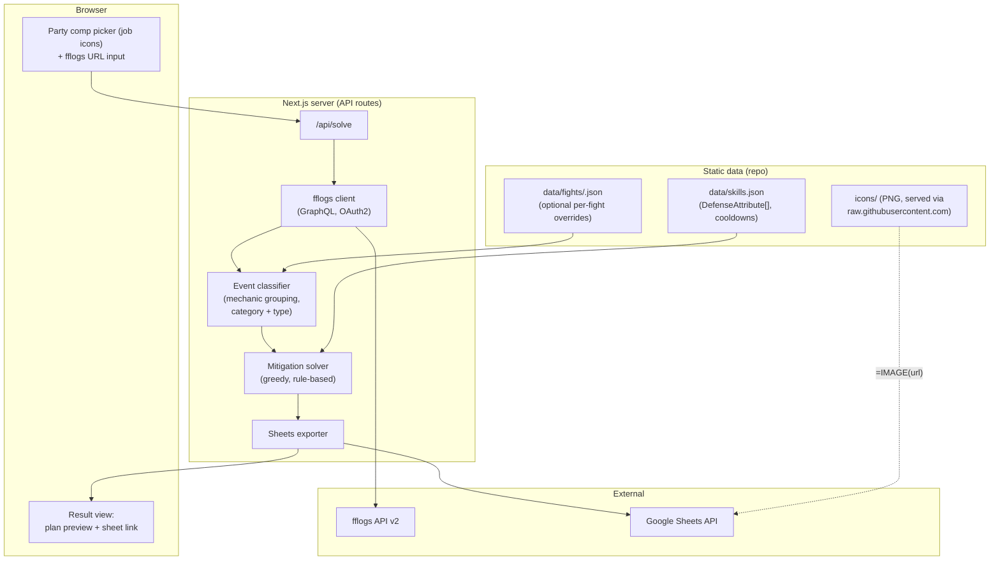

# FFXIV Defense Solver — Design Document

Date: 2026-07-10
Status: Draft — awaiting review
Repo: https://github.com/junyeopN/FFXIVDefensiveSolver

## 1. Goal

A web tool that, given a party composition and an fflogs fight log URL, produces a
mitigation plan: which defensive cooldown each party member uses on each boss
mechanic, so that every hit is survivable. The plan is written to a Google Sheet
in the format of the reference sheet
(https://docs.google.com/spreadsheets/d/1IOuecCvMqqGUk5boBHMoFSsSyVdCbTH8mfbGLUaDP7M),
where rows are timeline mechanics and columns are the 8 party members.

## 2. Architecture Overview

Single Next.js (TypeScript) application. The UI collects inputs; API routes run
the pipeline server-side (fflogs credentials and Google credentials never reach
the browser).



Data flow: fflogs URL → report code + fight id → raw events → damage timeline →
mitigation assignments → Google Sheet.

## 3. Data Model

### 3.1 Damage (one mechanic instance on the timeline)

```ts
type DamageType = "Magic" | "Physical" | "Dark";
type DamageCategory = "Raidwide" | "Tankbuster" | "Individual";

interface Damage {
  abilityId: number;          // fflogs ability game ID
  name: string;               // ability name from the log
  type: DamageType;
  category: DamageCategory;
  amount: number;             // raw (unmitigated) damage per target
  source: {
    name: string;             // boss/add casting the ability
    targetable: boolean;      // whether the source can be targeted at that time
  };
  castStart: number;          // ms from fight start (begincast event)
  castEnd: number;            // ms from fight start (damage snapshot)
  targets: number;            // players hit
  mitigable: boolean;         // false for most Dark damage (% mits don't apply)
}
```

### 3.2 Defensive skills

```ts
type DefenseType = "HealingIncrease" | "DamageReduction" | "Shield";

interface DefenseAttribute {
  type: DefenseType;
  needsTarget: boolean;       // usable only while the source/target is targetable
  amount: number;             // percent for HealingIncrease/DamageReduction;
                              // absorbed HP for Shield (see 3.3)
  appliesTo?: "Magic" | "Physical";  // omitted = all types
  duration: number;           // seconds
}

interface Skill {
  id: string;                 // e.g. "divine_veil"
  name: string;
  job: string;                // "pld" | ... | "tank" | "melee" | "caster" (role actions)
  icon: string;               // repo-relative path, e.g. icons/pld_divine_veil.png
  cooldown: number;           // seconds (recast)
  targeting: "self" | "single" | "party";
  attributes: DefenseAttribute[];
}
```

`data/skills.json` extends the existing `icons/manifest.json` (63 abilities
already have icons and action IDs) with the attributes above, maintained by hand.

### 3.3 Notes on modeling accuracy

- **Shield amounts** scale with the caster's healing power. v1 stores a fixed
  representative HP value per shield (tuned for current max-level gear) rather
  than computing from gear. Documented limitation.
- **Mitigation stacking** is multiplicative: `final = raw × ∏(1 − rᵢ)`.
- **Dark damage**: percent mitigation does not apply unless the fight override
  marks the ability as mitigable; shields and HP always count.
- **HealingIncrease** skills don't reduce damage; the solver uses them only to
  relax the survival margin (see 5.3).

### 3.4 Party composition

8 slots: T1, T2, H1, H2, D1–D4, each holding a job abbreviation. The UI
constrains to the standard 2/2/4 composition. Tank and healer max HP are read
from the log (`targetResources.maxHitPoints`); DPS HP likewise.

## 4. fflogs Parsing

1. **URL → report + fight**: parse the report code and `#fight=` fragment from
   the pasted URL; if no fight is specified, the UI lists fights in the report
   for the user to pick.
2. **Queries** (GraphQL, OAuth2 client-credentials token, cached until expiry):
   - `report.fights` — fight boundaries, encounterID, name
   - `report.masterData` — actors (players, jobs, boss entities), abilities
   - `report.events(dataType: DamageTaken, hostilityType: Friendlies)` —
     paginated; fields used: timestamp, abilityGameID, sourceID, targetID,
     `amount`, `unmitigatedAmount`, `absorbed`, `targetResources`
   - `report.events(dataType: Casts)` for `begincast`/`cast` (cast start times)
   - Buff events are NOT needed for v1 (we use `unmitigatedAmount`, which fflogs
     already back-computes).
3. **Mechanic grouping**: damage events with the same `abilityGameID` within a
   2-second window form one mechanic instance. Repeated casts (e.g. a raidwide
   ×3) appear as separate instances.
4. **Classification heuristics** (overridable per fight):

   | Rule | Category |
   |---|---|
   | ≥ 6 players hit | Raidwide |
   | ≤ 2 players hit, all tanks, damage ≥ 40% of tank max HP | Tankbuster |
   | otherwise | Individual |

   Damage type comes from the fflogs ability type field (physical / magical /
   special→Dark; exact numeric mapping verified during implementation).
   `amount` = max `unmitigatedAmount` across targets in the instance.
5. **Per-fight overrides** (`data/fights/<encounterId>.json`, optional): correct
   category/type, mark Dark abilities as (un)mitigable, mark phases where the
   boss is untargetable (affects `needsTarget` skills), and merge/rename
   mechanic instances for readability.

## 5. Mitigation Solver

### 5.1 Approach choice

Considered:
- **(A) Greedy rule-based** — process mechanics in lethality order, assign
  cheapest sufficient mitigation. Transparent, debuggable, mirrors how human
  sheet-makers plan. **Chosen for v1.**
- **(B) ILP / constraint optimization** — globally optimal, but requires a JS
  solver dependency, opaque failures, and an objective function we can't state
  precisely yet. Deferred; the solver module's interface (timeline + comp in,
  assignments out) allows swapping it in later.

### 5.2 Constraints

A skill can be assigned to a mechanic only if:
- its job is in the party (role actions: any member of that role with it free),
- it is off cooldown at `castEnd − lead` (each use blocks the skill for
  `cooldown` seconds; `lead` is a small buffer so buffs are up at snapshot),
- its `duration` covers the damage snapshot,
- `needsTarget` skills are only used while the source is targetable,
- single-target skills pick one recipient (busters: the aggro tank).

### 5.3 Survival requirement

For each mechanic, for each hit player:
`mitigatedDamage − shields ≤ currentHP margin`, where the margin assumes
healers can top the party between mechanics with `gap ≥ 10s`; tighter gaps
require extra mitigation or shields. HealingIncrease buffs widen the margin on
the following heals rather than reducing damage.

### 5.4 Assignment policy (v1 rules)

1. Sort mechanic instances by lethality ratio (`amount / targetMaxHP`) desc.
2. **Tankbusters**: aggro tank's short mit + one big personal; add externals
   (Intervention/Oblation/…, healer ST mits) until survivable; invulns reserved
   for the hardest busters where they trivialize the hit.
3. **Raidwides**: rotate party mitigation — Reprisal/Feint/Addle respecting
   type (`appliesTo`), tank party mits, ranged/caster mits, healer party
   cooldowns — until the target reduction is met (default: survivable with
   ≥ 20% max-HP buffer, configurable).
4. **Dark**: shields and HP checks only, unless override says mitigable.
5. **Individual**: shields/HealingIncrease coverage where damage is lethal;
   otherwise left to healers (no assignment).
6. Spread usage evenly so consecutive mechanics don't exhaust one member.

Output per mechanic: assignments `{member, skill}`, expected mitigated damage,
remaining effective HP — enough for the sheet and for debugging bad plans.

## 6. Google Sheets Export

- Creates a **new spreadsheet** (title: fight name + date) via a **service
  account**; the sheet is shared to the user's email as writer. (Alternative —
  user OAuth via NextAuth — deferred; see Open Questions.)
- Layout mirrors the reference sheet's 생존기 tab:
  - Columns: cast start, cast end, mechanic name, damage type, category, raw
    damage, aggro target, then one column per member (T1 T2 H1 H2 D1–D4) with
    a merged role header row.
  - Each assignment cell: skill icon via `=IMAGE("https://raw.githubusercontent.com/junyeopN/FFXIVDefensiveSolver/main/<icon>")`
    plus the skill name; job icons in the member header row the same way.
  - Conditional coloring: red rows for lethal-if-unmitigated, purple text for
    Dark damage (matches fflogs convention).
- The exporter takes the solver output and produces a `batchUpdate` payload;
  it does not know about fflogs — clean boundary for testing.

## 7. Next.js App

- **Pages**: one input page (party comp picker using `icons/jobs/*.png`, fflogs
  URL field, fight picker when needed) and one result page (link to the sheet +
  read-only HTML preview of the plan table).
- **API route** `/api/solve`: orchestrates fetch → classify → solve → export;
  streams progress (fetching / parsing / solving / exporting) to the UI.
- **Env**: `FFLOGS_CLIENT_ID`, `FFLOGS_CLIENT_SECRET`,
  `GOOGLE_SERVICE_ACCOUNT_KEY` (JSON), `SHEET_SHARE_EMAIL`.
- Module layout keeps pipeline stages independently testable:

```
src/
  lib/fflogs/      client.ts, queries.ts, parse.ts
  lib/classify/    grouping.ts, heuristics.ts, overrides.ts
  lib/solver/      solver.ts, constraints.ts, policy.ts
  lib/sheets/      exporter.ts, layout.ts
  data/            skills.json, fights/
  app/             page.tsx, result/, api/solve/route.ts
```

## 8. Error Handling

- Invalid/private log URL, wrong fight id → typed error to the UI with a
  human-readable message (fflogs errors mapped, not passed through raw).
- fflogs rate limiting → exponential backoff; report-level results cached
  in-memory keyed by report code + fight id.
- Solver cannot make a mechanic survivable → the plan is still produced; the
  mechanic's row is flagged ("unsurvivable with this comp") rather than failing
  the whole run.
- Sheets API failure after solving → return the plan preview anyway with a
  retry-export button.

## 9. Testing

- **Fixtures**: saved fflogs JSON responses for 1–2 real fights committed under
  `test/fixtures/` (golden logs) — no network in tests.
- **Unit**: classifier heuristics (event JSON → expected categories), solver
  constraints (cooldown collisions, needsTarget, Dark handling), stacking math.
- **Snapshot**: solver output for a golden log + fixed comp; sheet `batchUpdate`
  payload for a small plan.
- **Manual E2E**: one real log through the deployed app into a real sheet,
  compared against the reference sheet by eye.

## 10. Open Questions (defaults chosen, please confirm)

1. **Fight scope**: hybrid heuristics + per-fight overrides (chosen) vs fully
   curated fight database.
2. **Sheets auth**: service account creating + sharing sheets (chosen) vs user
   OAuth (sheets owned by the user directly).
3. **Shield amounts**: fixed representative values per skill (chosen) vs
   computing from gear/log stats.
4. **Healer GCD healing** is out of scope for v1 — the solver only plans
   cooldowns, not healing rotations. Confirm this matches intent.
5. **Deployment target**: assumed Vercel or local `next start`; no preference
   recorded yet.

## 11. Out of Scope (v1)

- DPS optimization / uptime planning; healing rotation planning.
- Multiple pull comparison, log browsing UI, saved plan history.
- Non-standard comps (double melee tanks, 1-healer runs).
- ILP-optimal assignment (interface reserved).
